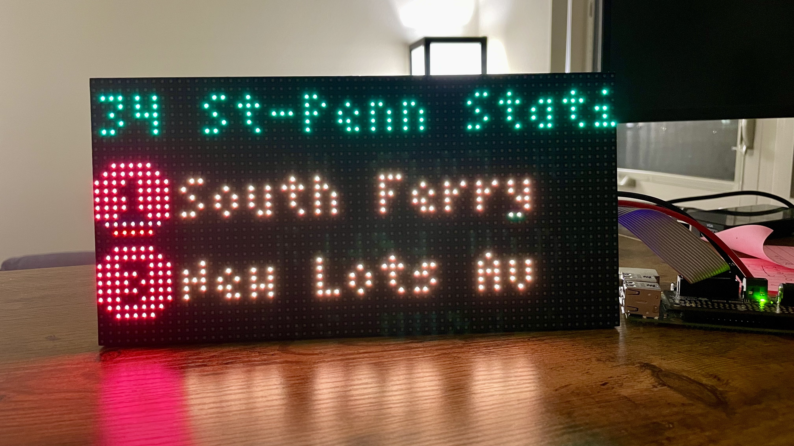
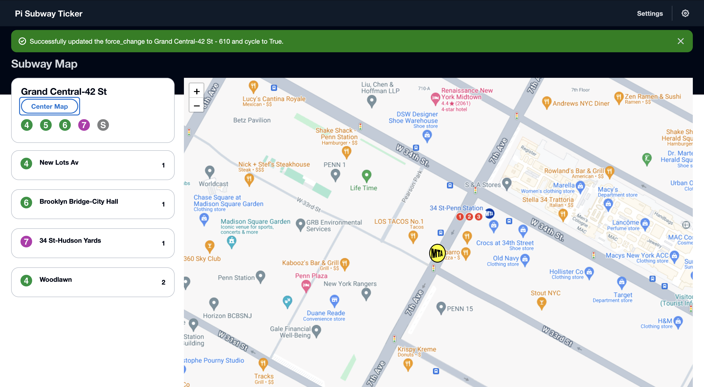
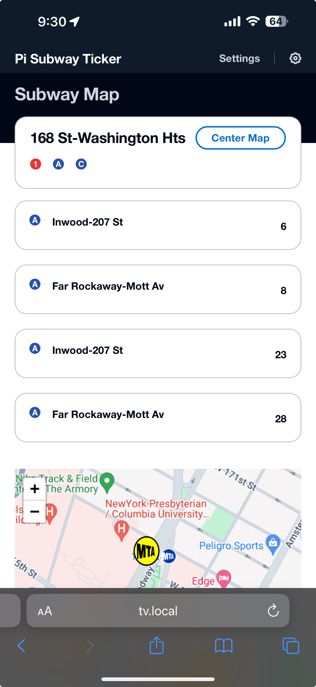

# Nuggies Pi Displays

A unified Raspberry Pi RGB LED matrix display system. Switch between an MTA subway departure board and a live stock ticker — all controlled from a responsive web app on your phone or desktop.

---

## Displays

### MTA Subway
Real-time departure times for your chosen NYC subway station, with station cycling and an interactive map to switch stations from the web UI.

| Penn Station | Yankee Stadium |
|:---:|:---:|
|  |  |

### Stocks
*(photos coming soon)*

---

## Web UI

| Desktop | Mobile |
|:---:|:---:|
|  |  |

---

## Hardware

- Adafruit 64×32 RGB LED matrix (single panel)
- Adafruit RGB Matrix HAT/Bonnet
- Raspberry Pi (tested on Pi 4)

---

## Setup

```bash
git clone <repo-url> nuggies_pi_displays
cd nuggies_pi_displays
chmod +x setup.sh
./setup.sh
```

`setup.sh` installs system packages, Node.js 22, Python dependencies, builds the RGB matrix library, and configures sudoers for the display processes.

---

## Running

### Option 1 — Development (screen sessions)

Runs the API with hot-reload and the website dev server in named `screen` windows. Good for active development.

```bash
# Start API in a screen session
screen -S nuggies-api -dm bash -c 'cd /home/pi/nuggies_pi_displays/api && python3 -m uvicorn main:app --host 0.0.0.0 --port 8000 --reload'

# Start website dev server in a screen session
screen -S nuggies-web -dm bash -c 'cd /home/pi/nuggies_pi_displays/website && npm start'
```

Attach to a session to see logs:
```bash
screen -r nuggies-api   # Ctrl+A then D to detach
screen -r nuggies-web
```

List all sessions:
```bash
screen -ls
```

Kill a session:
```bash
screen -S nuggies-api -X quit
screen -S nuggies-web -X quit
```

---

### Option 2 — Production (systemd services)

Registers the API and website as systemd services that start on boot and automatically restart on failure.

**1. Create the API service:**

```bash
sudo tee /etc/systemd/system/nuggies-api.service > /dev/null <<EOF
[Unit]
Description=Nuggies Display API
After=network.target

[Service]
User=pi
WorkingDirectory=/home/pi/nuggies_pi_displays/api
ExecStart=python3 -m uvicorn main:app --host 0.0.0.0 --port 8000
Restart=always
RestartSec=5

[Install]
WantedBy=multi-user.target
EOF
```

**2. Create the website service:**

```bash
sudo tee /etc/systemd/system/nuggies-web.service > /dev/null <<EOF
[Unit]
Description=Nuggies Display Website
After=network.target nuggies-api.service

[Service]
User=pi
WorkingDirectory=/home/pi/nuggies_pi_displays/website
ExecStart=npm run build && npx serve -s dist -l 8080
Restart=always
RestartSec=5

[Install]
WantedBy=multi-user.target
EOF
```

**3. Enable and start:**

```bash
sudo systemctl daemon-reload
sudo systemctl enable nuggies-api nuggies-web
sudo systemctl start nuggies-api nuggies-web
```

**Check status / logs:**

```bash
sudo systemctl status nuggies-api
sudo systemctl status nuggies-web

sudo journalctl -u nuggies-api -f
sudo journalctl -u nuggies-web -f
```

**Stop / disable:**

```bash
sudo systemctl stop nuggies-api nuggies-web
sudo systemctl disable nuggies-api nuggies-web
```

---

## Project Structure

```
nuggies_pi_displays/
├── setup.sh                  # Full install script
├── requirements-api.txt
├── requirements-display.txt
├── api/                      # FastAPI backend (port 8000)
│   ├── main.py
│   ├── run_api.sh
│   ├── helpers/              # Settings, logging, process management
│   └── endpoints/            # system/, mta/, stocks/
├── display/                  # LED matrix display processes
│   ├── mta/                  # MTA subway display
│   └── stocks/               # Stock ticker display
└── website/                  # React + Cloudscape web UI (port 8080)
    └── src/
        ├── hooks/            # useQuery data hooks
        ├── pages/            # home, mta, stocks, system
        ├── components/       # Map, train cards, etc.
        └── services/         # Axios API client
```

---

## API

| Method | Path | Description |
|--------|------|-------------|
| `GET` | `/system/status` | Display state and active mode |
| `POST` | `/system/display/start` | Start the active display |
| `POST` | `/system/display/stop` | Stop the active display |
| `POST` | `/system/display` | Switch mode (`mta` or `stocks`) |
| `POST` | `/system/restart` | Reboot the Pi |
| `GET` | `/mta/trains/next_four` | Next 4 trains at current station |
| `GET/PUT` | `/mta/configs` | MTA settings |
| `GET` | `/mta/stations` | All stations |
| `GET/PUT` | `/mta/stations/current` | Current station |
| `PUT` | `/mta/stations/{id}/enabled` | Toggle station enabled |
| `GET/PUT` | `/stonks/settings` | Stock ticker settings |

Interactive docs available at `http://nuggies.local:8000/docs`.
